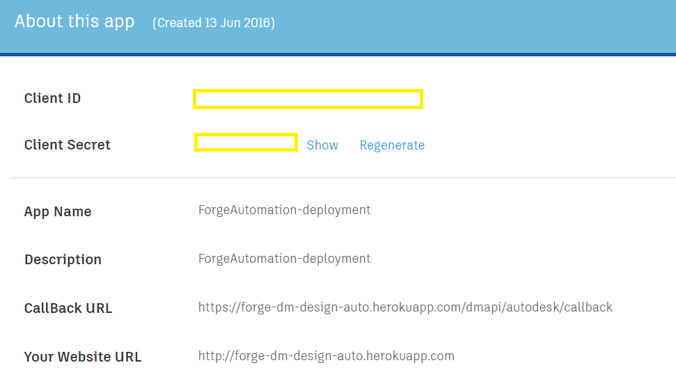
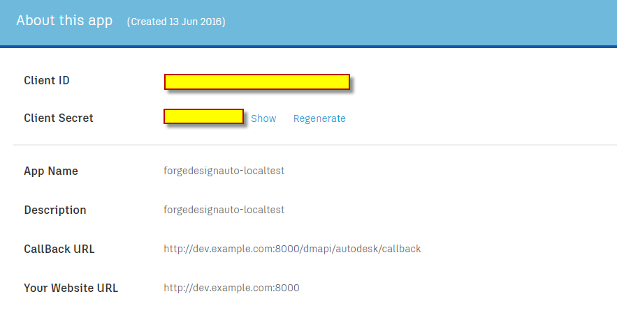

# Design Automation and Data Management of Forge for Jigsaw Sample

##  Description
This sample is extended from [jigsawify](https://github.com/KeanW/jigsawify) sample. The old sample provides a template drawing to embed the jigsaw by [Design Automation of Forge](https://developer.autodesk.com/en/docs/design-automation/v2). While current sample allows the user to select the drawing of his/her A360 repository, using [Data Management of Forge](https://developer.autodesk.com/en/docs/data/v2).

## Live demo
Try this sample live at https://forge-dm-design-auto.herokuapp.com/# (or see it running at [Jigsaw Demo](http://autode.sk/1XSkKtM)). You must have some DWG drawings under an A360 account. If you don't, then please go to [A360](https://a360.autodesk.com/) and create a project and upload some files.

##  Dependencies

* [App Package](management/CrxApp) and [Local Test Harness](management/ActivityManager) for `Design Automation of Forge`: Visual Studio 2012, 2013. 2015 should be also fine, but has not yet been tested. 
* Main of the sample: An Node.js code. It has been tested with version 4.4.5 of Node.js.
* [ObjectARX SDK] (http://usa.autodesk.com/adsk/servlet/index?siteID=123112&id=773204). The SDK version depends on which AutoCAD verison you want to test with the [App Package](management/CrxApp) locally. In current test, the version is AutoCAD 2016.

## Setup/Usage Instructions
1. Restore the packages of  [App Package](management/CrxApp) and [Local Test Harness](management/ActivityManager) by [NuGet](https://www.nuget.org/). The simplest way is 
  * VS2012: Projects tab >> Enable NuGet Package Restore. Then right click the project>>"Manage NuGet Packages for Solution" >> "Restore" (top right of dialog)
  * VS2013:  right click the project>>"Manage NuGet Packages for Solution" >> "Restore" (top right of dialog)
2. Unzip ObjectARX SDK. Add AcCoreMgd, AcDbMgd from SDK/inc to the the project [App Package](management/CrxApp). "Copy Local" = False.
3. Build project [App Package](management/CrxApp). It is better to test with local AutoCAD to verify the process. Steps:
  * Open AutoCAD (in this test, the version is 2016)
  * Open [demo drawing](assets/DWGTest1.dwg). Run command "netload", select the binary dll of `CrxApp`. Allow AutoCAD to load it.
  * Run command "JIGIO", select [demo parameter file](assets/parameters.txt), select[demo json file](assets/jigtest.json),  specify a output folder. 
  * Finally the jigsaw data will be embedded to the demo drawing. 
4. Apply credencials of Design Automation API from https://developer.autodesk.com/. Rename `_Credential.cs` in [Local Test Harness](management/ActivityManager) to `Credentials.cs`. Put your consumer key and secret key at line 12 and 13 of `Credentials.cs`.
5. Build project [Local Test Harness](management/ActivityManager) and run it. It will create a custom activity with the package from [App Package](management/CrxApp), create a work item to run a demo job, using a [demo drawing file](http://download.autodesk.com/us/support/files/autocad_2015_templates/acad.dwt) and a [demo json file] (http://through-the-interface.typepad.com/test/jigtest.json). Finally it outputs a result drawing that jigsaw data will be embedded. 
6. Create a new application on [https://developer.autodesk.com](https://developer.autodesk.com) with "**CallBack URL**" set to your own server address.  Rename `_config-prod.js` in [Routes](/routes) to `config-prod.js`. Put your consumer key and secret  at line 8 and 9 of `config-prod.js`.
  [] 
  * For local test, you will need to specify "**CallBack URL**"  to "http://dev.example.com". Add this line in your computer's `/etc/hosts` file: `127.0.0.1	dev.example.com`  .Here is some info on how to modify your "hosts" file: [https://support.rackspace.com/how-to/modify-your-hosts-file/](https://support.rackspace.com/how-to/modify-your-hosts-file/)
    [] 

